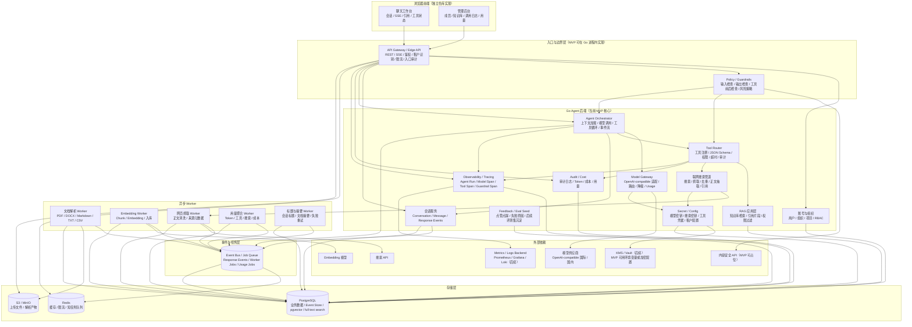

# AI Agent 团队知识助理 MVP 需求与技术实现方案

调研与方案基准日期：2026-05-03

## 1. 需求评估

现有《策划案》对长期方向判断基本合理：项目不应定位成普通聊天机器人，而应定位成具备模型路由、工具调用、联网检索、私域知识库、权限审计、成本统计和安全控制的 AI Agent 后端平台。这个方向与 OpenAI Responses API、Claude MCP Connector、Gemini Function Calling/Search Grounding、Dify Agent/Knowledge/Logs、LangGraph stateful agent 的演进趋势一致。

但原方案如果直接作为 MVP 执行，范围偏大。它同时包含多模型、联网、RAG、沙箱、管理后台、计费、安全、工作流、MCP、长期记忆、插件市场和企业 SSO，会导致首版交付周期长、安全风险高、验收标准分散。MVP 应先验证一条可商业化主链路：

```text
团队用户上传知识资料
  -> 在浏览器中发起多轮对话
  -> Agent 自动选择普通回答、知识库检索、联网搜索或轻量工具
  -> 生成带引用、带工具过程、可审计、可统计成本的回答
  -> 管理员可查看组织用量、调用日志、知识库状态和风险事件
```

因此，MVP 建议聚焦“团队/企业知识助理”，而不是个人通用助手、开发者 API 平台或完整 Agent OS。

### 1.1 合理部分

- 采用 Responses-style 事件化协议是必要的。Agent 过程包含模型调用、工具调用、工具结果、引用、文件、错误和成本，不能只保存最终 assistant 文本。
- Tool Router 应作为平台核心。Web Search、Knowledge Search、Calculator、Current Time、未来 MCP 和 Sandbox 都应统一走工具注册、权限、审计和超时控制。
- 多模型网关需要早做。供应商能力、价格和可用性会变化，业务层不能绑定单一模型 API。
- 组织、项目、用户、审计和成本字段需要从第一版贯穿链路，否则后续企业能力会返工。
- 联网和 RAG 内容都必须视为不可信输入，不能允许网页或文档中的 prompt injection 覆盖系统策略。

### 1.2 需要收敛的部分

- Python/项目级代码沙箱不进入 MVP。只预留 API 与工具类型，避免首版承担容器隔离、依赖管理、文件产物、网络白名单和逃逸防护成本。
- MCP Client/Server 不进入 MVP。只在工具注册模型中预留 `provider_type=mcp` 和凭据扩展字段。
- 工作流编排不进入 MVP。MVP 使用 Agent 工具循环；确定性 Workflow 放到团队版或企业版。
- 插件市场、长期记忆、多 Agent 协作、浏览器 GUI 操作 Agent、SSO 和私有化部署均后置。
- 管理后台保留最小运营功能，不做复杂 BI、账单结算和可视化工作流。

## 2. MVP 定位

### 2.1 产品定位

MVP 是一个面向团队和企业早期客户的 AI 知识助理系统，提供浏览器工作台和 Go 后端 Agent 服务。用户可以创建团队空间、上传知识资料、发起多轮问答；Agent 能结合私域知识库和联网搜索生成带引用的回答；管理员能追踪调用过程、成本和审计日志。

### 2.2 首批用户

- 小型企业团队：希望把内部文档、制度、产品资料、FAQ 接入 AI 问答。
- 售前/客服/运营团队：需要基于知识库生成回答、摘要、对比和报告。
- 内部效率工具团队：需要一个可审计、可扩展、可接入多模型的 Agent 后端底座。

### 2.3 成功标准

- 用户能在 10 分钟内完成注册、创建组织、上传文档、发起知识库问答。
- 回答能展示引用来源，用户可以定位到原文片段。
- 管理员能回放一次回答涉及的模型调用、工具调用、引用来源、错误和成本。
- 普通聊天首 token P95 小于 2 秒；知识库问答 P95 小于 12 秒；联网问答 P95 小于 20 秒。
- 工具调用失败时，用户能收到可理解的降级回答，后台保留完整失败原因。

## 3. 成熟产品启发

### 3.1 OpenAI Responses / Tools

OpenAI 将 Responses、Conversation State、Streaming、File Inputs、Web Search、File Search、MCP、Code Interpreter 等能力放在统一 Agent API 体系下。对本项目的启发是：内部协议应以 response/event/item 为中心，而不是传统 chat message 为中心。

参考：https://developers.openai.com/api/reference/overview

### 3.2 Gemini Function Calling / Search Grounding

Gemini Function Calling 强调模型只生成函数调用建议，由应用负责执行外部函数并把结果回传模型；Search Grounding 强调实时信息、搜索处理和引用。对本项目的启发是：模型网关只负责模型适配，工具执行必须由后端 Tool Router 控制；联网回答必须带引用。

参考：

- https://ai.google.dev/gemini-api/docs/function-calling
- https://ai.google.dev/gemini-api/docs/google-search

### 3.3 Claude MCP Connector

Claude MCP Connector 支持远程 MCP server、OAuth、多 server、allowlist/denylist 和 per-tool 配置，但也有只支持 tool calls、远程 HTTP server 等限制。对本项目的启发是：MVP 先做好工具注册、权限、凭据和审计模型，MCP 作为后续工具提供方接入，不在首版直接实现。

参考：https://platform.claude.com/docs/en/agents-and-tools/mcp-connector

### 3.4 Dify Agent / Knowledge / Logs

Dify 面向应用构建者提供 Agent、知识库、工具、日志、工作区和应用发布能力。对本项目的启发是：团队知识助理的 MVP 必须同时具备知识库管理、Agent 工具链路和可观测日志，否则难以用于真实团队场景。

参考：https://docs.dify.ai/en/use-dify/build/agent

### 3.5 LangGraph Stateful Agent

LangGraph 强调 durable execution、human-in-the-loop、memory、debugging 和 production deployment。对本项目的启发是：MVP 不需要引入复杂图编排，但需要保留状态持久化、事件回放和后续中断/恢复扩展点。

参考：https://docs.langchain.com/oss/python/langgraph/overview

## 4. MVP 功能清单

### 4.1 账号、组织与项目

必须支持：

- 用户注册、登录、退出。
- 组织创建与组织切换。
- 项目空间创建与切换。
- 成员角色：`owner`、`admin`、`member`、`viewer`。
- 组织、项目、用户维度的数据隔离。
- 管理员查看成员、用量、审计日志和知识库状态。

MVP 可简化：

- 登录可先支持邮箱密码，OAuth 作为可选。
- 不做企业 SSO。
- 不做复杂 ABAC，先用 RBAC + 资源归属校验。

### 4.2 浏览器聊天体验

必须支持：

- 会话列表、创建会话、重命名会话、删除会话。
- 多轮上下文。
- SSE 流式输出。
- Markdown、代码块、表格渲染。
- 引用卡片展示。
- 工具调用状态展示：`pending`、`running`、`succeeded`、`failed`。
- 错误提示与重试入口。
- 管理员或有权限用户查看调用详情。

MVP 可简化：

- 分享、收藏、会话分支后置。
- 复杂富文本编辑器后置，首版使用普通输入框 + 文件选择。

### 4.3 Agent 后端

必须支持：

- 加载组织、项目、用户、会话上下文。
- 根据用户请求和策略选择模型。
- 根据模型能力和任务类型提供可用工具。
- 支持模型原生 tool calling。
- 支持最大工具迭代次数，默认 5。
- 工具参数 JSON Schema 校验。
- 工具权限校验、超时、审计。
- 工具结果回传模型并继续生成。
- 事件流持久化和 SSE 输出。
- 失败降级：工具失败后允许模型基于已知信息给出说明。

Agent 执行流程：

```text
POST /v1/responses
  -> API Gateway 鉴权、租户识别、限流、入口审计
  -> Input Guardrails
  -> 创建 response
  -> 读取会话上下文
  -> 选择模型与工具
  -> 写入 response.created
  -> 调用模型并流式输出
  -> 如模型请求工具：
       -> 写入 tool_call.created
       -> 校验参数、权限、风险等级
       -> Tool Guardrails before execute
       -> 执行工具
       -> Tool Guardrails after execute
       -> 写入 tool_call.completed 或 tool_call.failed
       -> 将工具结果追加到模型上下文
       -> 继续模型调用
  -> 写入 citation.added / usage.updated / response.completed
  -> Output Guardrails
  -> Audit / Trace / Usage 持久化
```

### 4.4 模型网关

MVP 支持 2 类供应商：

- OpenAI-compatible 国际模型供应商。
- OpenAI-compatible 国内模型供应商。

统一能力：

- Chat/Responses 风格请求适配。
- SSE streaming 适配。
- Tool calling 适配。
- usage/token 解析。
- 错误码标准化。
- 超时、重试、降级。
- 模型能力标签：`tool_calling`、`streaming`、`vision`、`long_context`、`json_schema`。

模型路由 MVP 规则：

- 默认使用组织配置的主模型。
- 需要工具调用时只选择支持 `tool_calling=true` 的模型。
- 主模型失败时降级到备用模型，但降级前必须做能力对齐验证：备用模型必须支持当前请求所需的 `tool_calling`、`json_schema`、上下文长度和流式输出能力。
- 对带工具的请求，不能无脑降级。Model Gateway 需要验证主模型请求中的 `tools` 参数能否转换为备用模型支持的格式；无法转换时应返回 `model_fallback_not_compatible`，由 Agent 给出可理解失败提示。
- 成本控制先做静态模型选择，不做复杂自动路由。

### 4.5 知识库

必须支持：

- 创建知识库。
- 上传文档到知识库。
- 支持 PDF、DOCX、Markdown、TXT、CSV 基础解析。
- 文档解析状态：`uploaded`、`processing`、`ready`、`failed`。
- chunk 切分并保留文档、页码、标题、段落、行号等元数据。
- embedding 入库。
- 向量检索 + 关键词检索。
- 返回引用片段。
- 知识库按组织和项目隔离。
- 知识库预留 `visibility` 或 `access_policy`，MVP 默认项目内可见，后续可扩展到按角色、用户组或具体成员授权。

MVP 技术策略：

- 向量库使用 PostgreSQL + pgvector，降低组件复杂度。
- 关键词检索使用 PostgreSQL full text search；后续可迁移 OpenSearch。
- rerank 首版可选：若接入 rerank 模型则启用；否则使用向量分数 + 关键词分数融合。
- OCR、图片理解、复杂表格结构识别后置。

### 4.6 联网搜索

必须支持：

- 内置 `web_search` 工具。
- 搜索 API 接入。
- 搜索结果去重。
- 网页正文抽取。
- 来源可信度、发布时间、抓取时间记录。
- 引用片段提取。
- 对“今天、最新、政策、价格、新闻、版本、法规、体育比分、财报”等强时效问题强制联网。
- 网页内容作为不可信资料处理。

MVP 可简化：

- 不自建大规模爬虫。
- 抓取失败时保留搜索结果摘要并标记可信度较低。
- 搜索缓存设置短 TTL，强时效问题默认不使用长缓存。

### 4.7 工具系统

内置工具：

| 工具 | 风险等级 | 用途 |
| --- | --- | --- |
| `knowledge_search` | L0 | 查询组织或项目知识库 |
| `web_search` | L0 | 查询公网信息并生成引用 |
| `calculator` | L0 | 执行确定性数学计算 |
| `current_time` | L0 | 返回当前时间、时区和日期 |

工具定义字段：

- `name`
- `description`
- `provider_type`
- `category`
- `risk_level`
- `input_schema`
- `output_schema`
- `timeout_ms`
- `enabled`
- `org_id`
- `project_id`
- `auth_config`
- `created_by`

暂不支持：

- 用户自助创建插件。
- 工具市场。
- 写操作工具。
- L2/L3 高风险审批流。

但数据模型需预留 `risk_level`、`requires_confirmation`、`approval_policy`、`provider_type=mcp|http|builtin|sandbox`。

### 4.8 运营、安全与管理后台

必须支持：

- 按用户、组织、项目限流。
- 请求大小限制。
- 文件大小限制。
- Policy/Guardrails 边界：输入检查、输出检查、工具调用前后检查，MVP 可先接内容安全 API 或规则引擎占位。
- 审计日志：登录、文件上传、文档解析、模型调用、工具调用、管理配置变更。
- token 和成本统计。
- API Gateway 边界：统一处理鉴权、租户识别、限流、请求大小限制、SSE 连接管理和入口审计。
- Observability/Tracing：记录一次 Agent run 内的模型调用、工具调用、Guardrails、RAG、搜索和自定义事件。
- Event Bus/Job Queue：承载文档解析、embedding、网页抓取、用量聚合和异步标题生成任务。
- Secret/Config 管理：模型密钥、搜索密钥、embedding 密钥和工具凭据不能直接进入普通日志或模型上下文。
- 基础监控指标：请求量、错误率、延迟、模型失败率、工具失败率、RAG 命中率、Guardrails 拦截率。
- 轻量反馈：用户对回答点赞/点踩，管理员可在调用日志中查看反馈原因，为后续评测集沉淀数据。

管理后台页面：

- 成员管理。
- 知识库文档状态。
- 模型配置。
- 工具开关。
- 调用日志。
- 用量统计。
- 审计日志。

## 5. 后端技术实现方案

### 5.1 MVP 整体架构

MVP 采用“浏览器前端 + Go 模块化单体 + 异步 Worker + 外部模型/搜索供应商”的架构。首版不拆微服务，但在模块边界上保留后续拆分空间。



关键链路：

- 入口链路：浏览器请求先进入 API Gateway/Edge API，完成鉴权、租户识别、限流、请求大小限制、SSE 连接管理和入口审计。MVP 可在 Go 进程内实现，后续可替换为 APISIX/Kong/Envoy。
- Guardrails 链路：用户输入、最终输出、工具调用参数和工具结果都经过 Policy/Guardrails 边界。MVP 可先用规则 + 内容安全 API，占位保留后续模型安全检查和企业策略。
- 聊天链路：浏览器通过 `POST /v1/responses` 建立 SSE，Go 后端创建 response，Agent Orchestrator 调用模型并按事件流返回。
- 工具链路：模型产生 tool call 后，Tool Router 统一做参数校验、权限校验、超时控制、审计记录，再调用 `knowledge_search`、`web_search` 等内置工具。
- RAG 链路：文件上传到对象存储，异步 Worker 解析、切分、embedding 入库；查询时使用 pgvector + full text search 混合检索并返回引用片段。
- 联网链路：`web_search` 工具调用搜索 API 和网页抓取 Worker，清洗正文、记录来源元数据，再返回可引用资料。
- 事件链路：response events、worker jobs、usage jobs 统一进入 Event Bus/Job Queue。MVP 可使用 Redis + PostgreSQL event store，后续可替换 Kafka/NATS/Temporal。
- 运营链路：模型调用、工具调用、Guardrails、搜索、embedding 和事件写入统一关联 `trace_id / org_id / project_id / user_id / response_id`，用于审计、用量、trace 回放和故障排查。
- 凭据链路：模型密钥、搜索密钥、embedding 密钥、工具凭据通过 Secret/Config 读取，禁止进入模型上下文、普通日志和前端响应。

后续拆分方向：

- `API Gateway` 可从 Go 进程内边界替换为 APISIX/Kong/Envoy。
- `Policy/Guardrails` 可独立成策略与安全服务。
- `Model Gateway` 可独立成模型代理服务。
- `RAG 应用层 + 文档 Worker` 可独立成知识库服务。
- `Tool Router` 可独立成工具执行服务。
- `Observability/Tracing` 可对接专用日志、指标和 trace 平台。
- `Sandbox Service` 后续独立部署，不进入 MVP 主进程。

### 5.2 技术栈

| 层级 | MVP 选型 | 后续扩展 |
| --- | --- | --- |
| 主语言 | Go | 保持 Go 为主 |
| HTTP 框架 | Chi 或 Gin | 可拆 API Gateway |
| API Gateway | Go 中间件内置 | APISIX、Kong、Envoy |
| 数据库 | PostgreSQL | 分库分表、读写分离 |
| 向量检索 | pgvector | Qdrant、Milvus、OpenSearch Vector |
| 缓存/队列 | Redis + PostgreSQL event store | Kafka、Temporal、NATS |
| 对象存储 | S3/MinIO 抽象 | OSS、S3、私有对象存储 |
| 可观测性 | OpenTelemetry | Prometheus、Grafana、Loki、ClickHouse |
| 策略与安全 | Go Policy/Guardrails 模块 + 内容安全 API 占位 | 独立 Policy Service、OPA |
| Secret 管理 | 环境变量 + 数据库加密配置 | Vault、KMS、云 Secret Manager |
| 权限 | RBAC + 资源归属校验 | Casbin/OPA、ABAC |
| 部署 | Docker Compose 或单 K8s namespace | 多环境 K8s、灰度发布 |

### 5.3 代码分层

建议采用 Go 模块化单体：

```text
cmd/server
internal/gateway
internal/api
internal/app
internal/domain
internal/infra
internal/policy
internal/observability
internal/worker
internal/pkg
```

职责：

- `gateway`：入口中间件、鉴权、租户识别、限流、请求大小限制、SSE 连接管理、入口审计。
- `api`：HTTP handler、SSE、请求响应 DTO。
- `app`：用例层，如创建 response、上传文档、执行检索。
- `domain`：核心实体和领域接口，如 Response、ToolCall、KnowledgeBase。
- `infra`：数据库、Redis、对象存储、模型供应商、搜索供应商、embedding 供应商、Secret/Config 读取。
- `infra/eventbus`：定义 `Publisher`、`Subscriber`、`Message`、`Ack/Nack` 等抽象接口，业务层禁止直接依赖 Redis Stream、Asynq、Kafka 或 NATS 的 SDK。
- `policy`：输入、输出、工具参数、工具结果的 Guardrails 和企业策略。
- `observability`：trace、span、metrics、结构化日志、敏感字段脱敏。
- `worker`：文档解析、embedding、网页抓取、标题生成、用量聚合。
- `pkg`：通用工具，如 ID、时间、错误码、JSON Schema 校验。

拆服务边界预留：

- API Gateway 可从 `internal/gateway` 拆成独立入口网关。
- Policy/Guardrails 可从 `internal/policy` 拆成独立策略服务。
- Model Gateway 可从 `internal/infra/model` 拆成独立服务。
- RAG Worker 可从 `internal/worker/rag` 拆成独立服务。
- Tool Worker 可从 `internal/app/tool` 拆成独立服务。
- Observability/Tracing 可从 `internal/observability` 对接独立 telemetry pipeline。
- Sandbox Service 后续独立，不与主服务共进程。

### 5.4 基础设施边界

这些模块是成熟 Agent 产品中常见的生产化能力。MVP 不要求全部独立部署，但必须在代码和数据模型中明确职责边界。

| 模块 | MVP 实现 | 后续演进 |
| --- | --- | --- |
| API Gateway | Go 中间件内置，负责鉴权、租户识别、限流、请求大小限制、SSE 连接管理和入口审计 | 独立 APISIX/Kong/Envoy，支持 WAF、灰度、企业网络接入 |
| Policy/Guardrails | 规则引擎 + 内容安全 API 占位，覆盖输入、输出、工具参数、工具结果 | 独立策略服务，支持 OPA、模型安全检查、企业自定义策略 |
| Observability/Tracing | OpenTelemetry trace/span，记录 Agent run、model span、tool span、guardrail span | 对接 Prometheus、Grafana、Loki、ClickHouse、专用 trace dashboard |
| Event Bus/Job Queue | Redis Stream/Asynq + PostgreSQL event store | Kafka/NATS/Temporal，支持长任务、重试、恢复和工作流 |
| Secret/Config | 环境变量 + 数据库加密字段，凭据只在服务端解析 | Vault/KMS/云 Secret Manager，支持租户级密钥轮换 |
| Feedback/Eval Seed | 回答点赞/点踩、失败原因、管理员标记问题样本 | 评测集、自动回归、模型路由质量评估 |

执行顺序要求：

```text
入口请求
  -> API Gateway 鉴权、租户识别、限流
  -> Input Guardrails
  -> Agent Orchestrator
  -> Model Gateway / Tool Router
  -> Tool Guardrails before execute
  -> Tool execution
  -> Tool Guardrails after execute
  -> Output Guardrails
  -> Response Events / Audit / Trace / Usage
```

关键约束：

- Guardrails 必须能阻断模型调用和工具调用，不能只是记录日志。
- Trace 与 Audit 分开：Trace 用于调试性能和链路，Audit 用于合规追责。
- Secret/Config 只返回服务端运行所需凭据引用，任何密钥不得出现在 response events、tool results、trace payload 和前端响应中。
- Event Bus 既承载异步任务，也承载可回放事件索引；首版可共用 Redis/PostgreSQL，但接口必须隔离。
- 业务层只能依赖 `internal/infra/eventbus` 中的发布/订阅抽象，不允许直接调用 Redis Stream、Asynq、Kafka 或 NATS 客户端。Redis Stream 的 at-least-once、消费组 ACK 与 PostgreSQL event store 的事务语义不同，必须通过 outbox/inbox、幂等 key 和 ACK/NACK 语义封装掉实现差异。

### 5.5 Agent Orchestrator 状态机

核心接口：

```go
type Orchestrator interface {
    Run(ctx context.Context, req RunRequest) (<-chan ResponseEvent, error)
}
```

MVP 的 `RunRequest` 表示一次单 Agent 执行。接口实现时应预留 `agent_id`、`session_id` 或 `run_mode` 等扩展字段，避免后续多 Agent 协作、handoff、工作流节点执行时重写 Orchestrator 边界。后续可演化为 `AgentSession` 管理多个 Agent run、handoff 和中间状态。

关键输入：

- `org_id`
- `project_id`
- `user_id`
- `conversation_id`
- `input`
- `attachments`
- `enabled_tools`
- `model`
- `stream`

关键策略：

- 最大工具迭代次数：默认 5。
- 单次模型调用超时：默认 60 秒。
- 单个工具超时：默认按工具定义，MVP 5-15 秒。
- 工具结果最大体积：默认 64KB，MVP 只做截断并显式标记 `truncated=true` 和 `original_size_bytes`。LLM 摘要化会引入额外模型调用、成本和失败点，放到 P1.5 优化。
- 上下文窗口：按模型能力动态截断，优先保留系统策略、最近对话、工具结果摘要和引用。

事件写入原则：

- 事件先持久化，再发送给 SSE 客户端。
- 每个事件带 `seq`，保证前端可按序重放。
- 失败事件必须包含标准错误码和用户可见提示。

### 5.6 事件协议

事件类型：

| 类型 | 说明 |
| --- | --- |
| `response.created` | response 已创建 |
| `message.delta` | assistant 文本增量 |
| `message.completed` | assistant 文本片段完成 |
| `tool_call.created` | 工具调用创建 |
| `tool_call.delta` | 工具执行过程增量，可选 |
| `tool_call.completed` | 工具调用成功 |
| `tool_call.failed` | 工具调用失败 |
| `citation.added` | 新增引用 |
| `usage.updated` | token、工具、搜索、embedding 成本更新 |
| `response.completed` | response 完成 |
| `response.failed` | response 失败 |

事件示例：

```json
{
  "id": "evt_01",
  "response_id": "resp_01",
  "conversation_id": "conv_01",
  "seq": 12,
  "type": "tool_call.completed",
  "created_at": "2026-05-03T12:00:00+08:00",
  "data": {
    "tool_call_id": "call_01",
    "tool_name": "knowledge_search",
    "status": "succeeded",
    "latency_ms": 328,
    "result_summary": "命中 4 个文档片段"
  }
}
```

SSE 输出格式：

```text
event: tool_call.completed
data: {"id":"evt_01","response_id":"resp_01","seq":12,"type":"tool_call.completed","data":{}}
```

### 5.7 模型网关

统一请求：

```json
{
  "model": "auto",
  "messages": [],
  "tools": [],
  "stream": true,
  "response_format": {
    "type": "text"
  },
  "metadata": {
    "org_id": "org_01",
    "project_id": "proj_01",
    "user_id": "user_01",
    "trace_id": "trace_01"
  }
}
```

统一输出：

- `text_delta`
- `tool_call_delta`
- `tool_call_completed`
- `usage`
- `finish_reason`
- `provider_error`

错误映射：

| 标准错误码 | 说明 |
| --- | --- |
| `model_timeout` | 模型调用超时 |
| `model_rate_limited` | 供应商限流 |
| `model_auth_failed` | 密钥无效 |
| `model_context_exceeded` | 上下文超限 |
| `model_tool_call_invalid` | 工具调用参数无效 |
| `model_fallback_not_compatible` | 备用模型不兼容当前工具、JSON Schema、上下文或流式能力 |
| `model_provider_unavailable` | 供应商不可用 |

### 5.8 RAG 管道

写入流程：

```text
上传文件
  -> 写 files/file_objects
  -> 创建 document
  -> 异步解析
  -> 文本标准化
  -> chunk 切分
  -> embedding
  -> 写 document_chunks
  -> document 状态变 ready
```

查询流程：

```text
用户问题
  -> query rewrite，可选
  -> 向量检索 topK
  -> 关键词检索 topK
  -> 分数融合
  -> 权限过滤
  -> 引用片段组装
  -> 返回给 Agent
```

chunk 策略：

- 中文文档默认 500-800 字一个 chunk。
- overlap 默认 80-120 字。
- 保留标题路径、页码、段落序号、表格标识。
- CSV 按行组或语义块切分，保留列名。

### 5.9 联网搜索管道

```text
Agent 调用 web_search
  -> 生成或接收 query
  -> 调用搜索供应商
  -> URL 去重
  -> 抓取网页正文
  -> 清洗导航/广告
  -> 提取标题、作者、发布时间、正文 hash
  -> 选择引用片段
  -> 返回 sources + snippets
```

安全策略：

- 网页正文进入模型时包装为非可信资料。
- 禁止网页内容改写系统指令、工具权限、输出格式约束。
- 对医疗、法律、金融类问题增加权威来源优先策略。

### 5.10 沙箱预留

MVP 不实现代码执行，但预留：

- `tool_definitions.provider_type = sandbox`
- `sandbox_sessions`
- `sandbox_runs`
- API 路径占位文档：`POST /v1/sandbox/sessions`、`POST /v1/sandbox/sessions/{id}/runs`

接口返回：

```json
{
  "error": {
    "code": "feature_not_enabled",
    "message": "Sandbox is not enabled in MVP."
  }
}
```

后续实现要求：

- Sandbox Service 独立部署。
- 不与主业务服务共进程。
- 默认禁止公网访问。
- 使用非 root、cgroups、seccomp/AppArmor、临时目录、超时和磁盘配额。

## 6. 浏览器前端方案

前端需要建设，但不在当前仓库实现。

### 6.1 技术建议

推荐：

- React + TypeScript + Vite，适合轻量独立工作台。
- 或 Next.js，适合后续官网、控制台、服务端渲染和鉴权集成。
- UI 组件可选择 Radix UI、shadcn/ui 或 Ant Design，企业控制台场景优先选择信息密度高、稳定的组件体系。

### 6.2 页面结构

必须页面：

- 登录页。
- 组织/项目选择页。
- 聊天工作台。
- 知识库管理页。
- 管理后台首页。
- 调用日志页。
- 审计日志页。
- 模型与工具配置页。

### 6.3 聊天工作台布局

采用三栏结构：

```text
左侧：会话列表、项目切换、知识库入口
中间：消息流、输入框、附件上传、流式回答
右侧：引用来源、工具调用过程、文件详情、成本信息
```

交互要求：

- SSE 事件按 `seq` 渲染。
- `message.delta` 合并为 assistant 文本。
- `tool_call.created` 显示工具卡片 running。
- `tool_call.completed` 更新为 success。
- `tool_call.failed` 更新为 failed，并展示用户可见错误。
- `citation.added` 在右侧引用抽屉展示，可点击定位原文片段。
- `usage.updated` 展示本次估算成本。

### 6.4 管理后台

管理员需要看到：

- 组织总用量。
- 模型调用次数、token、成本。
- 工具调用次数、失败率、耗时。
- 知识库文档解析状态。
- 最近审计日志。
- 配置项变更历史。

## 7. 数据模型草案

### 7.1 账号与组织

- `users`
  - `id`
  - `email`
  - `password_hash`
  - `identity_provider`
  - `external_id`
  - `name`
  - `status`
  - `created_at`
  - `updated_at`
- `organizations`
  - `id`
  - `name`
  - `plan`
  - `status`
  - `created_at`
  - `updated_at`
- `org_members`
  - `org_id`
  - `user_id`
  - `role`
  - `status`
  - `joined_at`
- `projects`
  - `id`
  - `org_id`
  - `name`
  - `settings`
  - `created_at`
  - `updated_at`

### 7.2 会话与事件

关系约定：

- 一次 `POST /v1/responses` 创建一个 `response_id`，并最终对应一条 assistant `message`。
- 该 assistant message 下有多个 `message_items`，类型包括 `output_text`、`tool_call`、`tool_result`、`citation`、`attachment`、`usage_summary`。
- `response_events` 是同一个 response 的流式事件视图，用于 SSE、调试和回放；历史会话加载优先读取 `messages/message_items`，过程回放读取 `response_events`。
- 用户输入创建一条 user `message`；Agent 输出创建一条 assistant `message`。工具调用不单独创建 message，而是作为 assistant message 的 item 和 response event 存储。

- `conversations`
  - `id`
  - `org_id`
  - `project_id`
  - `user_id`
  - `title`
  - `status`
  - `created_at`
  - `updated_at`
- `messages`
  - `id`
  - `conversation_id`
  - `response_id`
  - `role`
  - `status`
  - `created_at`
- `message_items`
  - `id`
  - `message_id`
  - `type`
  - `content`
  - `metadata`
  - `created_at`
- `response_events`
  - `id`
  - `response_id`
  - `conversation_id`
  - `seq`
  - `type`
  - `data`
  - `created_at`

### 7.3 模型与用量

- `model_providers`
  - `id`
  - `org_id`
  - `name`
  - `provider_type`
  - `base_url`
  - `credential_ref`
  - `enabled`
- `models`
  - `id`
  - `provider_id`
  - `name`
  - `capabilities`
  - `pricing`
  - `enabled`
- `model_invocations`
  - `id`
  - `org_id`
  - `project_id`
  - `response_id`
  - `model_id`
  - `provider`
  - `input_tokens`
  - `output_tokens`
  - `latency_ms`
  - `status`
  - `error_code`
  - `created_at`
- `usage_records`
  - `id`
  - `org_id`
  - `project_id`
  - `user_id`
  - `source_type`
  - `source_id`
  - `quantity`
  - `unit`
  - `estimated_cost`
  - `created_at`

### 7.4 工具

- `tool_definitions`
  - `id`
  - `org_id`
  - `project_id`
  - `name`
  - `provider_type`
  - `description`
  - `risk_level`
  - `input_schema`
  - `output_schema`
  - `timeout_ms`
  - `enabled`
  - `auth_config`
- `tool_calls`
  - `id`
  - `org_id`
  - `project_id`
  - `response_id`
  - `tool_id`
  - `tool_name`
  - `args_hash`
  - `args_redacted`
  - `status`
  - `latency_ms`
  - `error_code`
  - `created_at`
- `tool_results`
  - `id`
  - `tool_call_id`
  - `result_ref`
  - `result_summary`
  - `result_redacted`
  - `created_at`

### 7.5 文件与知识库

- `files`
  - `id`
  - `org_id`
  - `project_id`
  - `user_id`
  - `filename`
  - `mime_type`
  - `size_bytes`
  - `sha256`
  - `purpose`
  - `status`
  - `created_at`
  - `updated_at`
- `file_objects`
  - `id`
  - `file_id`
  - `storage_provider`
  - `bucket`
  - `object_key`
  - `etag`
  - `version_id`
  - `created_at`
- `knowledge_bases`
  - `id`
  - `org_id`
  - `project_id`
  - `name`
  - `visibility`
  - `access_policy`
  - `settings`
  - `created_at`
- `documents`
  - `id`
  - `knowledge_base_id`
  - `file_id`
  - `title`
  - `status`
  - `error_message`
  - `created_at`
  - `updated_at`
- `document_chunks`
  - `id`
  - `document_id`
  - `org_id`
  - `project_id`
  - `chunk_index`
  - `content`
  - `metadata`
  - `embedding`
  - `created_at`

### 7.6 审计与配置

- `audit_logs`
  - `id`
  - `org_id`
  - `project_id`
  - `actor_user_id`
  - `action`
  - `resource_type`
  - `resource_id`
  - `ip`
  - `user_agent`
  - `metadata`
  - `created_at`
- `trace_spans`
  - `id`
  - `trace_id`
  - `parent_span_id`
  - `org_id`
  - `project_id`
  - `response_id`
  - `span_type`
  - `name`
  - `status`
  - `started_at`
  - `ended_at`
  - `attributes_redacted`
- `guardrail_events`
  - `id`
  - `org_id`
  - `project_id`
  - `response_id`
  - `scope`
  - `policy_name`
  - `action`
  - `reason`
  - `metadata`
  - `created_at`
- `feedback`
  - `id`
  - `org_id`
  - `project_id`
  - `user_id`
  - `response_id`
  - `rating`
  - `reason`
  - `created_at`
- `rate_limits`
  - `id`
  - `org_id`
  - `scope`
  - `limit_key`
  - `window_seconds`
  - `max_requests`
- `secret_refs`
  - `id`
  - `org_id`
  - `project_id`
  - `provider`
  - `purpose`
  - `ref`
  - `status`
  - `created_at`
  - `updated_at`
- `settings`
  - `id`
  - `org_id`
  - `project_id`
  - `key`
  - `value`
  - `updated_by`
  - `updated_at`

## 8. API 草案

### 8.1 创建 Agent 响应

```http
POST /v1/responses
Authorization: Bearer <token>
Content-Type: application/json
Accept: text/event-stream
```

请求：

```json
{
  "project_id": "proj_01",
  "conversation_id": "conv_01",
  "model": "auto",
  "input": "根据知识库总结一下本季度产品 FAQ，并补充最近公开资料中的变化。",
  "tools": [
    { "type": "knowledge_search", "knowledge_base_ids": ["kb_01"] },
    { "type": "web_search" }
  ],
  "stream": true
}
```

响应为 SSE 事件流。

### 8.2 查询事件回放

```http
GET /v1/responses/{response_id}/events
```

响应：

```json
{
  "data": [
    {
      "id": "evt_01",
      "seq": 1,
      "type": "response.created",
      "data": {}
    }
  ]
}
```

### 8.3 文件上传

```http
POST /v1/files
Content-Type: multipart/form-data
```

表单字段：

- `project_id`
- `purpose=knowledge_base`
- `file`

P1 已实现的文件 API：

```http
GET /v1/files?project_id=proj_01
GET /v1/files/{file_id}
GET /v1/files/{file_id}/content
DELETE /v1/files/{file_id}
```

实现约束：

- MVP 采用后端鉴权代理上传/下载，不直接暴露预签名 URL。
- 对象 key 固定为 `orgs/{orgID}/projects/{projectID}/files/{fileID}/{safe_filename}`，不使用用户原始路径。
- 文件内容只进入对象存储，日志、trace、response events 只记录 file id、大小、MIME、hash 和对象 key。
- 删除采用数据库软删除 + 对象存储 best-effort 删除；对象删除失败不阻断元数据不可见。

### 8.4 知识库

```http
POST /v1/knowledge_bases
POST /v1/knowledge_bases/{id}/documents
POST /v1/knowledge_bases/{id}/search
GET /v1/knowledge_bases/{id}/documents
```

知识库搜索请求：

```json
{
  "query": "退款政策是什么？",
  "top_k": 8,
  "filters": {
    "document_ids": []
  }
}
```

### 8.5 会话

```http
GET /v1/conversations?project_id=proj_01
GET /v1/conversations/{id}
PATCH /v1/conversations/{id}
DELETE /v1/conversations/{id}
```

### 8.6 管理后台

```http
GET /v1/admin/usage
GET /v1/admin/audit_logs
GET /v1/admin/traces/{trace_id}
GET /v1/admin/tool_calls
GET /v1/admin/model_invocations
GET /v1/admin/knowledge_bases/{id}/documents
PATCH /v1/admin/tools/{id}
PATCH /v1/admin/models/{id}
```

### 8.7 反馈与评测样本

```http
POST /v1/responses/{response_id}/feedback
GET /v1/admin/feedback
POST /v1/admin/feedback/{id}/promote_to_eval_case
```

反馈请求：

```json
{
  "rating": "down",
  "reason": "引用不准确",
  "comment": "回答引用了过期的政策文档"
}
```

MVP 只需要记录反馈和管理员标记，不需要实现完整自动评测平台。被标记的反馈样本进入后续 eval set 建设。

## 9. 迭代路线图

### 9.1 P0：技术验证，2-3 周

目标：打通最小 Agent 链路。

交付：

- Go HTTP 服务骨架。
- API Gateway 中间件：鉴权、租户识别、限流、入口审计。
- 用户、组织、项目基础模型。
- `POST /v1/responses` SSE demo。
- OpenAI-compatible 模型适配。
- 内置 `current_time`、`calculator` 工具。
- 事件持久化。
- 基础 trace/span 记录。
- 基础调用日志。

验收：

- 一次请求可流式输出。
- 模型可触发工具调用并获得最终回答。
- 后台可查到 response events 和 tool calls。

### 9.2 P1：MVP 可用版，4-6 周

目标：真实团队可试用。

交付：

- 登录、组织、项目、成员角色。
- 浏览器聊天工作台接口。
- 知识库上传、解析、embedding、检索。
- `knowledge_search` 工具。
- `web_search` 工具。
- 引用展示数据结构。
- 模型网关双供应商。
- 限流、审计、用量统计。
- 管理后台基础接口。

验收：

- 用户可上传文档并基于知识库问答。
- 联网问题能返回来源引用。
- 管理员能查看组织用量、模型调用、工具调用、trace 和审计日志。
- 输入、输出、工具参数、工具结果具备 Guardrails 拦截与记录。

### 9.3 P1.5：能力增强，3-5 周

目标：提高稳定性、准确率和企业试点能力。

交付：

- rerank。
- 文档版本。
- 更细粒度权限。
- 内容安全策略接入。
- 搜索缓存。
- Prompt/模型配置灰度。
- Feedback 样本沉淀为评测集。
- Secret/Config 接入 Vault/KMS 或云 Secret Manager。
- 沙箱服务技术验证，但默认关闭。

### 9.4 P2：团队/企业版

目标：进入付费团队和企业客户。

交付：

- 企业 SSO。
- MCP Client。
- 工作流编排。
- 长期记忆。
- 高风险工具审批。
- Prompt 版本管理。
- 评测集和自动回归。
- 私有化部署方案。

## 10. 测试与验收

### 10.1 后端单元测试

- Agent 状态机：无工具、单工具、多工具、工具失败、超过最大迭代。
- Tool Router：参数校验、权限拒绝、超时、错误映射。
- Model Gateway：streaming、tool calling、usage 解析、供应商错误映射。
- Policy/Guardrails：输入拦截、输出拦截、工具前置拦截、工具结果脱敏。
- Secret/Config：凭据引用解析、密钥脱敏、禁写日志。
- RAG：chunk 切分、权限过滤、检索排序、引用生成。
- Web Search：结果去重、抓取失败、引用片段生成。

### 10.2 集成测试

- 注册登录、创建组织、创建项目。
- 上传文件、文档解析、embedding 入库。
- 创建会话、发起知识库问答、验证 SSE 事件顺序。
- 发起联网问题、验证来源引用。
- 管理员查询用量、审计、trace 和工具调用日志。
- 用户提交点赞/点踩，管理员可查看并标记为评测样本。

### 10.3 安全测试

- 用户不能访问其他组织的会话、文件、知识库和日志。
- viewer 不能修改知识库、模型和工具配置。
- 超大 prompt、超大文件、超高频请求被限制。
- 文档和网页中的 prompt injection 不能覆盖系统策略。
- 输入、输出、工具参数、工具结果中的高风险内容能触发 Guardrails。
- 工具参数中的敏感信息在日志中脱敏。
- 模型密钥、搜索密钥、工具凭据不会出现在 response events、trace payload 和前端响应中。

### 10.4 性能验收

| 场景 | 指标 |
| --- | --- |
| 普通聊天 | 首 token P95 < 2s，完成 P95 < 10s |
| 知识库问答 | 完成 P95 < 12s |
| 联网问答 | 完成 P95 < 20s |
| 工具调用 | 成功率 > 98% |
| 模型调用 | 非供应商故障失败率 < 1% |
| 文档解析 | 50MB 以下文件可异步处理并展示状态 |

### 10.5 前端验收

- 流式文本稳定渲染，不乱序、不重复。
- 工具卡片状态正确。
- 引用可展开并定位原文。
- 长代码块、长表格、长引用不会撑破布局。
- 移动端和桌面端主要流程可用。
- 管理员能定位一次回答的模型调用、工具调用、引用和成本。

## 11. 风险与应对

### 11.1 Agent 不稳定

风险：模型可能误用工具、循环调用、生成不完整回答。

应对：

- 设置最大工具迭代次数。
- 工具结果大小限制。
- 工具失败降级。
- 对工具使用场景写入系统策略。
- 事件回放用于调试。

### 11.2 RAG 准确率不足

风险：chunk 不合理、召回不准、引用不可信会影响企业试用。

应对：

- 保留文档结构元数据。
- 向量 + 关键词混合检索。
- 引用必须来自命中文档片段。
- P1.5 引入 rerank 和评测集。

### 11.3 联网内容污染

风险：网页包含 prompt injection 或低质量内容。

应对：

- 网页内容以非可信资料注入。
- 来源可信度评分。
- 强时效问题展示抓取时间。
- 高风险领域优先权威来源。

### 11.4 成本失控

风险：长上下文、工具循环、联网和 embedding 可能导致成本不透明。

应对：

- 每次模型调用记录 usage。
- 每个工具调用记录成本。
- 组织维度预算和限流。
- 上下文截断与摘要。
- 搜索和工具结果缓存。

### 11.5 后续扩展返工

风险：MVP 如果只做聊天，会难以扩展到 MCP、沙箱、工作流和企业权限。

应对：

- 第一版保留事件协议。
- 工具注册模型保留 provider_type 和 risk_level。
- 数据全链路带 org_id、project_id、user_id、trace_id。
- 沙箱作为独立服务预留，不进入主进程。

## 12. 后续扩展设计

### 12.1 MCP

后续新增：

- `mcp_servers`
- `mcp_credentials`
- `mcp_tool_mappings`

接入原则：

- MCP 工具进入统一 Tool Router。
- 支持 allowlist/denylist。
- OAuth 凭据不进入模型上下文。
- MCP 工具调用全量审计。

### 12.2 沙箱

后续新增独立 Sandbox Service：

- Python Code Interpreter 模式。
- 文件输入和产物下载。
- CPU、内存、磁盘、网络限制。
- 默认公网关闭，白名单开启。
- 运行结束自动销毁。

### 12.3 工作流

后续支持确定性 Workflow：

- LLM 节点。
- Tool 节点。
- RAG 节点。
- Search 节点。
- Condition 节点。
- Human Approval 节点。

Workflow 与 Agent 的关系：

- Agent 适合自由探索任务。
- Workflow 适合客服、审批、日报、数据处理等稳定流程。

### 12.4 长期记忆

后续新增：

- 用户偏好记忆。
- 组织知识沉淀。
- 可查看、可删除、可关闭。
- 记忆写入需有策略和审计。

### 12.5 企业 SSO

MVP 不实现企业 SSO，但数据模型需要预留：

- `users.identity_provider`
- `users.external_id`
- 组织级登录策略配置。

后续接入 OIDC/SAML 时，`external_id + identity_provider` 作为外部身份唯一键，避免只依赖 email 导致账号合并、员工离职和多 IdP 场景返工。

### 12.6 多 Agent 协作

MVP 的 Orchestrator 是单 Agent 工具循环。为后续多 Agent 协作预留：

- `agent_id`
- `agent_session_id`
- `run_mode`
- `handoff` 事件类型。

后续演进时应引入 `AgentSession` 概念，由 session 管理多个 Agent run、消息路由、handoff、共享上下文和最终汇总。MVP 不实现多 Agent，但不要把 Orchestrator 接口写死为只能处理一个全局默认 Agent。

## 13. 最终建议

MVP 不应追求“一次做完整 Agent 平台”，而应先把团队知识助理的闭环做稳：

```text
组织/项目
  -> 知识库
  -> 多轮聊天
  -> Agent 工具循环
  -> RAG/联网引用
  -> 事件回放
  -> 审计与成本
```

这条链路能验证真实用户价值，也能为后续 MCP、沙箱、工作流、多 Agent、企业 SSO 和私有化部署保留架构空间。首版最重要的不是功能数量，而是每一次 Agent 行为都可解释、可回放、可控、可计费、可扩展。
