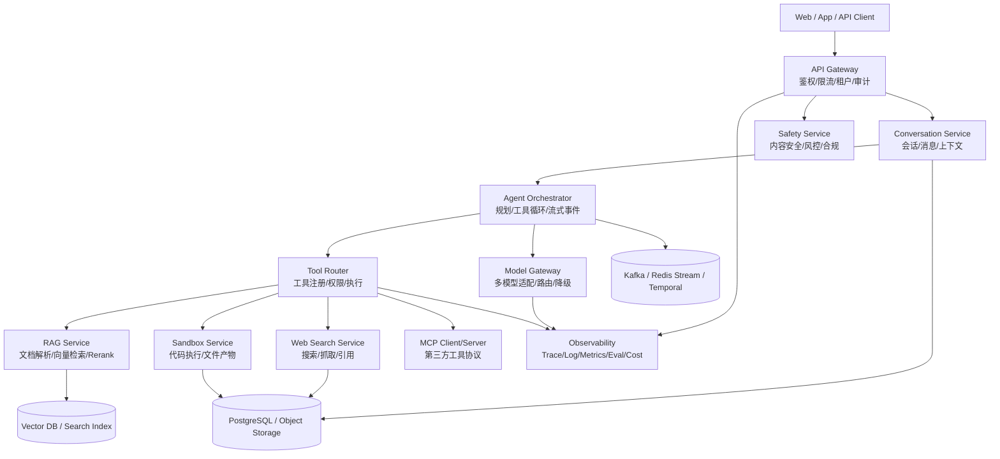

以下是一份可直接作为立项文档雏形使用的后端策划案。调研基准为 **2026-05-03** 可查公开资料。

# AI Agent 服务后端完整策划案

## 1. 项目定位

你要做的不是单纯“聊天机器人后端”，而是一个 **AI Agent 后端平台**：用户通过聊天入口提出问题，系统根据任务自动选择模型、调用工具、联网检索、读取文件、运行代码、生成附件，并把全过程纳入权限、审计、成本与安全控制。

成熟产品的共同趋势很清晰：OpenAI 的 Responses API 已把 web search、file search、computer use、code interpreter、remote MCP 等内置工具放进统一 agent-like 接口，并支持多轮状态与工具上下文；Claude API 将工具分为应用侧执行的 client tools 与 Anthropic 侧执行的 server tools；Gemini API 提供函数调用、Google Search grounding 与代码执行；阿里云百炼智能体强调 RAG、插件、MCP、记忆与工作流；火山方舟/豆包的 Responses API 文档也把联网搜索、私域知识库、MCP、函数调用等作为工具调用能力来组织。([OpenAI 开发者][1])

**一句话定位：**
做一个面向 C 端和企业端的多模型 AI Agent 后端，核心能力包括：聊天、多模型路由、工具调用、联网查询、RAG 私域知识库、代码沙箱、文件处理、长短期记忆、权限审计、计费限流与安全合规。

---

## 2. 成熟产品对标与启发

| 产品/平台                   | 值得学习的能力                                                                                                                                                                                     | 对本项目的启发                                                                 |
| ----------------------- | ------------------------------------------------------------------------------------------------------------------------------------------------------------------------------------------- | ----------------------------------------------------------------------- |
| ChatGPT / OpenAI API    | Responses API 是统一的 agent-like 接口，支持 web search、file search、computer use、code interpreter、remote MCP，并支持一次请求内的多工具 agentic loop 与 stateful context。([OpenAI 开发者][1])                          | 内部协议应设计成“Responses 风格”：消息、推理项、工具调用、工具结果都作为事件/Item，而不是只存一条 assistant 文本。 |
| OpenAI Code Interpreter | 可让模型在沙盒中写并运行 Python，用于数据分析、数学、代码问题、生成图表和文件；其容器是 fully sandboxed virtual machine，且应按临时容器处理。([OpenAI 开发者][2])                                                                                 | 沙箱必须作为独立服务建设，和聊天服务隔离，支持文件输入、资源限制、产物下载、过期回收。                             |
| Claude / Anthropic      | 工具调用分 client tools 与 server tools；client tools 由你的应用执行，server tools 由 Anthropic 执行。Claude MCP connector 可直接连接远程 MCP server，支持 allowlist/denylist、OAuth、多个 MCP server。([Claude Platform][3]) | 工具系统要区分“平台托管工具”“客户自定义工具”“第三方 MCP 工具”，并支持权限白名单、鉴权与审批。                    |
| MCP 标准                  | MCP 是连接 LLM 应用与外部数据源/工具的开放协议，强调 consent、authorization、privacy、tool safety。([模型上下文协议][4])                                                                                                    | 不要为每个第三方系统写死插件，应预留 MCP Client/Server 能力，让工具生态可扩展。                       |
| Gemini                  | Gemini 函数调用用于连接外部 API，覆盖扩充知识、扩展功能、执行操作；Grounding with Google Search 可与代码执行、URL context、函数调用组合；代码执行能力可让模型生成并运行 Python。([Google AI for Developers][5])                                        | 工具调用、联网检索、代码执行要能组合，而不是互斥功能。                                             |
| 通义千问 / 阿里云百炼            | 百炼智能体支持 RAG、插件、MCP、复用智能体/工作流、记忆；工作流可把复杂任务拆成有序步骤，并组合大模型、API、函数计算等节点。([阿里云帮助中心][6])                                                                                                           | 后端要同时支持“自动 Agent”与“确定性工作流”，企业场景不能完全依赖模型自由规划。                            |
| 豆包 / 火山方舟               | 火山方舟 Responses API 工具调用文档包含 Web Search、Image Process、Knowledge Search、Remote MCP、Function Calling 等工具方向。([火山引擎][7])                                                                         | 国内产品落地时，工具体系、知识库、MCP 和合规安全应同时规划。                                        |

---

## 3. 产品范围设计

### 3.1 MVP 必须支持

1. **用户聊天**

   * 多轮会话
   * 流式输出
   * Markdown / 代码块 / 表格 / 文件结果
   * 会话标题生成、历史记录、收藏、分享

2. **多模型接入**

   * OpenAI、Claude、Gemini、通义千问、豆包、DeepSeek、私有模型
   * 模型能力标签：是否支持工具调用、视觉、长上下文、代码、联网、结构化输出
   * 模型路由：简单任务走低价模型，复杂推理走高能力模型

3. **工具调用**

   * Function Calling
   * 工具注册中心
   * 工具参数 JSON Schema 校验
   * 工具权限、超时、重试、审计
   * 工具调用过程可追踪

4. **联网查询时事**

   * 搜索引擎接入
   * 网页抓取与正文抽取
   * 来源去重、排序、摘要
   * 回答附引用
   * 新鲜度策略：实时问题强制联网，常识问题不联网

5. **代码沙箱**

   * Python 代码执行
   * 文件上传、CSV/Excel/JSON/PDF 处理
   * 图表与文件生成
   * 超时、内存、CPU、磁盘限制
   * 禁止默认公网访问或只允许白名单访问

6. **文件与知识库**

   * 文件上传
   * 文档解析
   * Chunk 切分
   * Embedding 入库
   * 向量检索 + 关键词检索 + rerank
   * 私域知识问答

7. **基础安全与运营**

   * 用户登录
   * 组织/项目/租户
   * 速率限制
   * Token 统计
   * 成本统计
   * 审计日志
   * 内容安全策略

### 3.2 第二阶段能力

* MCP Client：连接第三方 MCP Server
* MCP Server：把你平台内部工具开放给外部 Agent
* 长期记忆
* 工作流编排器
* 插件市场
* 企业 SSO / RBAC
* 私有化部署
* 多模态：图片理解、语音输入、TTS
* Agent 评测平台
* Prompt 版本管理
* 模型自动评测与灰度

### 3.3 第三阶段能力

* 浏览器/GUI 操作型 Agent
* 代码项目级沙箱：可运行完整 repo、测试、预览网页
* 多 Agent 协作
* 自动任务计划
* 企业数据连接器：飞书、钉钉、Slack、Notion、GitHub、Jira、数据库
* 开放 API 平台与开发者生态

---

## 4. 总体架构



---

## 5. 核心后端模块

### 5.1 API Gateway

职责：

* 用户鉴权：JWT、OAuth、企业 SSO
* 租户隔离：org_id、project_id、user_id
* 速率限制：按用户、组织、模型、工具分别限流
* 请求大小限制：防止超长 prompt、超大文件、恶意输入
* 灰度发布：模型、工具、Prompt、工作流按租户灰度
* 请求审计：记录 IP、UA、用户、会话、模型、工具、成本

建议技术：

* Kong / APISIX / Envoy / NGINX
* 自研鉴权层用 Go、Node.js 或 Java
* Redis 做限流计数
* OPA 或 Casbin 做权限策略

---

### 5.2 Conversation Service

不要只存 `role + content`。成熟 Agent 后端应存储更细的消息结构。

建议消息结构：

```json
{
  "conversation_id": "conv_xxx",
  "message_id": "msg_xxx",
  "role": "assistant",
  "items": [
    { "type": "reasoning_summary", "text": "需要联网查询最新信息" },
    { "type": "tool_call", "tool": "web_search", "call_id": "call_1", "args": {} },
    { "type": "tool_result", "call_id": "call_1", "result_ref": "result_1" },
    { "type": "output_text", "text": "最终回答..." }
  ],
  "model": "xxx",
  "usage": {
    "input_tokens": 1000,
    "output_tokens": 500
  }
}
```

核心能力：

* 多轮上下文读取
* 长上下文截断
* 自动摘要压缩
* 会话分支
* 附件引用
* 工具调用链回放
* 用户可见事件流

---

### 5.3 Agent Orchestrator

这是整个平台最关键的部分。

职责：

1. 加载系统提示词、用户消息、历史上下文、记忆、文件上下文。
2. 根据任务判断可用工具集。
3. 调用模型。
4. 如果模型返回工具调用，进入工具执行循环。
5. 校验工具参数、权限、风险。
6. 执行工具，拿到工具结果。
7. 把工具结果回传给模型。
8. 循环直到生成最终回答。
9. 做输出安全检查、引用检查、格式化。
10. 持久化全链路事件。

伪流程：

```text
用户请求
  -> 输入安全检查
  -> 加载会话上下文
  -> 选择模型与工具
  -> 模型生成
      -> 需要工具？
          -> 参数校验
          -> 权限检查
          -> 风险审批
          -> 执行工具
          -> 写入 tool_result
          -> 再次调用模型
      -> 不需要工具？
          -> 输出回答
  -> 输出安全检查
  -> 存储消息与审计
  -> 流式返回
```

建议实现：

* Python：适合快速接模型、工具、RAG
* TypeScript：适合与前端/API 协议一致
* Temporal：适合长任务、重试、超时、状态机
* Kafka / Redis Stream：适合事件流与异步工具结果

---

### 5.4 Model Gateway

模型网关不要让业务代码直接调用各家模型 API。

统一模型接口：

```json
{
  "model": "auto|gpt|claude|qwen|doubao|local",
  "messages": [],
  "tools": [],
  "response_format": {},
  "stream": true,
  "metadata": {
    "org_id": "org_xxx",
    "user_id": "user_xxx",
    "risk_level": "normal"
  }
}
```

核心能力：

* 多供应商适配
* 模型能力注册
* 自动路由
* 失败降级
* 重试与熔断
* Token 统计
* 成本估算
* Prompt caching
* 输出格式修复
* 供应商密钥隔离

路由策略示例：

| 任务     | 模型选择                                |
| ------ | ----------------------------------- |
| 普通聊天   | 低成本快速模型                             |
| 复杂推理   | 高推理模型                               |
| 中文知识问答 | 国产强中文模型                             |
| 代码生成   | Coding 模型                           |
| 需要工具调用 | 支持 tool calling 的模型                 |
| 需要联网引用 | 支持工具调用 + web search 管道              |
| 企业私有部署 | 私有模型 / vLLM / Ollama / TensorRT-LLM |

---

### 5.5 Tool Registry / Tool Router

工具是 Agent 平台的核心资产。

工具定义：

```json
{
  "name": "get_weather",
  "description": "查询指定城市天气",
  "category": "read",
  "risk_level": "low",
  "timeout_ms": 5000,
  "schema": {
    "type": "object",
    "properties": {
      "city": { "type": "string" }
    },
    "required": ["city"]
  },
  "auth": {
    "type": "service_key"
  },
  "visibility": {
    "org_ids": ["org_xxx"]
  }
}
```

工具分级：

| 等级       | 示例                      | 策略            |
| -------- | ----------------------- | ------------- |
| L0 只读低风险 | 天气、汇率、搜索                | 自动执行          |
| L1 只读敏感  | CRM 查询、订单查询、数据库查询       | 权限校验 + 审计     |
| L2 写操作   | 发邮件、创建工单、修改订单           | 用户确认          |
| L3 高风险   | 转账、删除数据、执行 shell、外部网络请求 | 强确认 + 审批 + 限额 |
| L4 禁止    | 窃取凭证、绕过权限、破坏系统          | 拒绝执行          |

工具执行必须做：

* JSON Schema 参数校验
* 类型转换
* 权限校验
* 超时控制
* 幂等 key
* 重试策略
* 结果大小限制
* 敏感信息脱敏
* 完整审计日志
* 工具描述防注入处理

---

## 6. 联网查询与时事能力

联网查询不要简单把搜索结果塞给模型，而要做成独立管道。

### 6.1 查询流程

```text
用户问题
  -> 判断是否需要联网
  -> 生成搜索 query
  -> 调用搜索 API
  -> 获取候选网页
  -> 抓取正文
  -> 清洗广告/导航/重复内容
  -> 来源可信度评分
  -> 时间新鲜度评分
  -> 语义 rerank
  -> 提取引用片段
  -> 交给模型生成带引用回答
```

### 6.2 必备策略

* 对“今天、最新、股价、政策、体育比分、产品价格、法律法规”等问题强制联网。
* 对医疗、法律、金融等高风险内容，优先权威来源。
* 新闻类问题按发布时间和事件发生时间排序。
* 回答中必须展示来源引用。
* 搜索结果缓存，但对强时效问题设置短 TTL。
* 抓取网页时保留标题、作者、发布时间、抓取时间、URL、正文 hash。
* 防止 prompt injection：网页正文只能作为非可信资料，不可覆盖系统指令。

---

## 7. 代码沙箱设计

代码沙箱应是独立服务，绝不能和主业务服务共用运行环境。OpenAI Code Interpreter 的公开文档也明确把代码运行放在沙盒容器/虚拟机中，并建议把容器视为临时环境、需要保存的文件应及时下载。([OpenAI 开发者][2])

### 7.1 沙箱模式

| 模式                  | 用途               | 能力                            |
| ------------------- | ---------------- | ----------------------------- |
| Code Interpreter 模式 | 数据分析、数学、画图、文件处理  | Python、常用数据科学包、文件产物           |
| Project Runner 模式   | 用户上传项目、运行测试、生成补丁 | Python/Node/Go/Java、测试命令、构建日志 |
| Notebook 模式         | 类似 Jupyter 的逐步运行 | 保持 session 状态、变量、图表           |
| Browser Preview 模式  | 前端代码预览           | Vite/Next.js 预览、截图、日志         |

### 7.2 安全隔离

建议采用：

* Kubernetes Job / Pod per session
* gVisor / Kata Containers / Firecracker 级隔离
* 非 root 用户
* 只读基础镜像
* 临时工作目录
* cgroups 限制 CPU、内存、进程数
* 磁盘配额
* wall-clock 超时
* seccomp / AppArmor
* 默认禁止公网访问
* 如需联网，仅允许域名白名单
* 禁止访问云元数据服务
* 不向沙箱注入生产密钥
* 文件上传先过病毒扫描和类型检测
* 执行日志全量审计
* 运行结束自动销毁容器

### 7.3 资源配额建议

| 资源         |      免费用户 |    付费用户 |     企业用户 |
| ---------- | --------: | ------: | -------: |
| CPU        |    1 core |  2 core |      可配置 |
| 内存         | 512MB-1GB | 2GB-4GB | 4GB-16GB |
| 单次运行时长     |    10-30s | 60-120s |      可配置 |
| 磁盘         |     256MB |     1GB |      可配置 |
| 网络         |      默认关闭 |     白名单 |     企业策略 |
| 并发 session |         1 |     2-5 |      可配置 |

---

## 8. RAG 私域知识库

### 8.1 文档处理流程

```text
文件上传
  -> 文件类型识别
  -> 安全扫描
  -> 文本抽取
  -> 版面/表格/图片处理
  -> Chunk 切分
  -> 元数据标注
  -> Embedding
  -> 向量库 + 关键词索引
  -> 查询时 hybrid search
  -> rerank
  -> 生成带引用回答
```

### 8.2 知识库设计重点

* 支持 PDF、DOCX、PPTX、XLSX、CSV、Markdown、HTML、图片 OCR。
* Chunk 要保留文档、页码、标题层级、表格位置。
* 检索采用 hybrid：向量检索 + BM25 + rerank。
* 企业知识库按组织、项目、权限隔离。
* 支持文档版本。
* 支持引用原文片段。
* 支持“只基于知识库回答”模式，降低幻觉。
* 支持知识库评测集：问题、标准答案、应命中文档。

---

## 9. 数据库表设计

| 表                 | 作用                     |
| ----------------- | ---------------------- |
| users             | 用户                     |
| organizations     | 企业/团队                  |
| projects          | 项目空间                   |
| api_keys          | API 密钥                 |
| conversations     | 会话                     |
| messages          | 消息主表                   |
| message_items     | 消息中的文本、工具调用、工具结果、引用、附件 |
| model_invocations | 每次模型调用记录               |
| tool_definitions  | 工具注册                   |
| tool_calls        | 工具调用记录                 |
| tool_results      | 工具结果                   |
| sandbox_sessions  | 沙箱会话                   |
| sandbox_runs      | 每次代码执行                 |
| files             | 文件元数据                  |
| file_objects      | 对象存储引用                 |
| vector_stores     | 向量库                    |
| documents         | 文档                     |
| document_chunks   | 文档切片                   |
| memories          | 长期记忆                   |
| prompt_versions   | Prompt 版本              |
| workflows         | 工作流定义                  |
| workflow_runs     | 工作流运行                  |
| audit_logs        | 审计日志                   |
| usage_records     | Token、工具、沙箱、搜索成本记录     |
| safety_events     | 风控与内容安全事件              |
| eval_sets         | 评测集                    |
| eval_runs         | 评测运行                   |

---

## 10. 对外 API 设计

建议兼容 OpenAI 风格，但内部保持自有 Responses 协议。

### 10.1 聊天 / Agent API

```http
POST /v1/responses
```

请求示例：

```json
{
  "model": "auto",
  "conversation_id": "conv_xxx",
  "input": "帮我查一下今天 AI 行业有什么重要新闻，并总结成表格",
  "tools": [
    { "type": "web_search" }
  ],
  "stream": true
}
```

### 10.2 文件 API

```http
POST /v1/files
GET /v1/files/{file_id}
DELETE /v1/files/{file_id}
```

### 10.3 沙箱 API

```http
POST /v1/sandbox/sessions
POST /v1/sandbox/sessions/{id}/runs
GET /v1/sandbox/runs/{run_id}
GET /v1/sandbox/files/{file_id}/content
```

### 10.4 工具 API

```http
POST /v1/tools
GET /v1/tools
PATCH /v1/tools/{tool_id}
POST /v1/tools/{tool_id}/test
```

### 10.5 知识库 API

```http
POST /v1/vector_stores
POST /v1/vector_stores/{id}/documents
POST /v1/vector_stores/{id}/search
```

### 10.6 管理 API

```http
GET /v1/usage
GET /v1/audit_logs
POST /v1/evals/runs
GET /v1/model_routes
```

---

## 11. 工作流编排

除了自由 Agent，还需要“确定性工作流”。阿里云百炼工作流的思路是把复杂任务拆成有序步骤，并组合大模型、API、函数计算等节点，这非常适合企业场景。([阿里云帮助中心][8])

建议内置节点：

| 节点             | 作用        |
| -------------- | --------- |
| Start          | 输入参数      |
| LLM            | 调用模型      |
| Tool           | 调用工具      |
| Search         | 联网搜索      |
| RAG            | 知识库检索     |
| Code           | 运行代码      |
| Condition      | 条件判断      |
| Human Approval | 人工审批      |
| Transform      | JSON/文本转换 |
| HTTP           | 调用外部 API  |
| End            | 输出结果      |

典型工作流：

* 舆情日报：搜索新闻 → 去重 → 分类 → 摘要 → 生成报告
* 数据分析：上传 CSV → 沙箱分析 → 图表 → 解读
* 客服工单：识别意图 → RAG 查文档 → 低置信度转人工
* 企业助理：查询 CRM → 查询订单 → 生成邮件 → 用户确认 → 发送

---

## 12. 安全与合规

### 12.1 内容安全

OpenAI 的生产安全建议包括 moderation、红队测试、human-in-the-loop、限制输入输出、KYC、问题举报机制和安全标识符等。([OpenAI 开发者][9])

本项目建议：

* 输入审核：违法、暴力、色情、诈骗、仇恨、隐私泄露、自伤等。
* 输出审核：模型生成结果二次检查。
* 工具调用审核：高风险工具必须确认。
* 代码审核：危险命令、网络访问、文件系统访问限制。
* Web 内容防注入：网页资料不可信，不能覆盖系统指令。
* 用户举报入口。
* 黑名单与限权策略。
* 未成年人保护策略。
* 安全事件留痕。

### 12.2 中国境内合规

如果服务面向中国境内公众提供生成文本、图片、音频、视频等服务，需要关注《生成式人工智能服务管理暂行办法》；该办法明确要求保护个人信息、建立投诉举报机制、按深度合成规定对图片视频等生成内容进行标识，并规定具有舆论属性或者社会动员能力的服务需按规定开展安全评估和算法备案。([中国政府网][10])

落地前应准备：

* 用户协议与隐私政策
* 数据处理说明
* 个人信息最小化收集
* 用户删除/导出数据机制
* 生成内容标识
* 投诉举报入口
* 内容安全策略
* 算法备案/安全评估材料
* 日志留存策略
* 未成年人保护策略

法律与监管事项需由专业律师和合规团队复核。

### 12.3 工具安全

MCP 规范强调用户 consent、data privacy、tool safety，尤其工具可能代表任意代码执行或敏感数据访问，Host 应在调用工具前获得用户授权并提供清晰的审批界面。([模型上下文协议][4])

建议策略：

* 工具按风险分级。
* 每个工具声明数据访问范围。
* 敏感工具首次使用弹窗授权。
* 写操作必须二次确认。
* 工具结果脱敏后再给模型。
* 工具描述和工具返回都视为不可信输入。
* 租户级工具白名单。
* 工具调用全链路审计。

---

## 13. 技术选型建议

| 层级                 | 推荐                                                     |
| ------------------ | ------------------------------------------------------ |
| API Gateway        | APISIX / Kong / Envoy                                  |
| 业务后端               | Go / Java / Node.js                                    |
| Agent Orchestrator | Python / TypeScript                                    |
| 工作流                | Temporal / Cadence / Argo Workflows                    |
| 数据库                | PostgreSQL                                             |
| 缓存                 | Redis                                                  |
| 消息队列               | Kafka / Pulsar / Redis Stream                          |
| 对象存储               | S3 / OSS / MinIO                                       |
| 向量库                | pgvector / Milvus / Qdrant / Elasticsearch Vector      |
| 搜索                 | OpenSearch / Elasticsearch                             |
| 沙箱                 | Kubernetes + gVisor/Kata/Firecracker                   |
| 可观测性               | OpenTelemetry + Prometheus + Grafana + Loki/ClickHouse |
| 日志分析               | ClickHouse / OpenSearch                                |
| 模型服务               | 外部 API + vLLM 私有模型                                     |
| 权限                 | RBAC + ABAC + Casbin/OPA                               |
| Secret 管理          | Vault / KMS                                            |
| 部署                 | Kubernetes                                             |
| CI/CD              | GitHub Actions / GitLab CI / ArgoCD                    |

---

## 14. 计费与成本模型

成本来源：

| 成本项        | 说明                     |
| ---------- | ---------------------- |
| 模型输入 Token | 用户输入、历史上下文、RAG 片段、工具结果 |
| 模型输出 Token | 模型回答、推理摘要、结构化输出        |
| 联网搜索       | 搜索 API、网页抓取、rerank     |
| 代码沙箱       | CPU、内存、运行时长、文件存储       |
| 文件处理       | OCR、解析、Embedding       |
| 向量库        | 存储、检索、rerank           |
| 工具调用       | 第三方 API 费用             |
| 长期记忆       | 存储与检索成本                |
| 日志审计       | 高并发下成本明显               |

计费方式：

* 免费版：每日消息数、沙箱次数、联网次数限制。
* Pro 版：更高额度、更强模型、更多沙箱资源。
* Team 版：多人协作、知识库、管理后台。
* Enterprise 版：SSO、审计、私有知识库、私有部署、定制模型。
* API 版：按 Token + 工具 + 沙箱资源计费。

成本控制策略：

* 简单任务走低价模型。
* 长上下文自动压缩。
* RAG 只召回必要片段。
* Web 搜索缓存。
* 工具结果缓存。
* 沙箱资源按需创建、自动销毁。
* 每组织预算上限。
* 异常成本告警。

---

## 15. 关键指标

### 15.1 产品指标

| 指标      | 建议目标          |
| ------- | ------------- |
| 日活用户    | 按渠道拆分         |
| 人均对话轮次  | 衡量粘性          |
| 工具调用占比  | 衡量 Agent 能力使用 |
| 联网回答满意度 | 衡量时事体验        |
| 沙箱成功率   | 衡量代码能力        |
| 文件问答命中率 | 衡量 RAG 质量     |
| 分享率/留存率 | 衡量产品价值        |

### 15.2 技术指标

| 指标             | 建议目标        |
| -------------- | ----------- |
| 普通聊天首 token 延迟 | P95 < 2s    |
| 普通聊天完成延迟       | P95 < 10s   |
| 联网查询完成延迟       | P95 < 20s   |
| 代码运行成功率        | > 95%       |
| 工具调用成功率        | > 98%       |
| 模型调用失败率        | < 1%        |
| 系统可用性          | 99.9% 起步    |
| 成本误差           | 账单估算误差 < 5% |

### 15.3 安全指标

| 指标                   | 说明           |
| -------------------- | ------------ |
| 高风险请求拦截率             | 内容安全效果       |
| Prompt injection 命中率 | Web/RAG/工具安全 |
| 工具越权次数               | 应为 0         |
| 沙箱逃逸事件               | 应为 0         |
| 敏感信息泄露事件             | 应为 0         |
| 用户举报处理时效             | 合规运营指标       |

---

## 16. 阶段路线图

### P0：技术验证

目标：验证核心技术链路。

交付：

* 多模型网关
* 流式聊天
* 基础会话存储
* Function Calling demo
* Web Search demo
* Python 沙箱 demo
* 文件上传与简单解析
* Token 统计
* 基础日志

### P1：MVP 上线版

目标：能给真实用户使用。

交付：

* 用户系统
* 完整聊天体验
* 联网查询带引用
* Python 代码沙箱
* 文件问答
* 工具注册中心
* 基础 RAG
* 管理后台
* 限流与计费
* 内容安全
* 审计日志
* 基础监控告警

### P2：企业增强版

目标：支持团队和企业客户。

交付：

* 组织/项目/成员/RBAC
* 企业知识库
* MCP Client
* 工作流编排
* 长期记忆
* 工具审批
* SSO
* Prompt 版本管理
* 模型路由策略
* 评测平台
* 私有化部署方案

### P3：平台生态版

目标：做成开发者平台。

交付：

* 插件市场
* MCP Server
* Agent 模板市场
* 多 Agent 协作
* 浏览器操作 Agent
* 项目级代码执行
* API 开放平台
* 计费结算系统
* 第三方应用集成

---

## 17. 团队配置建议

最小可行团队：

| 角色         | 职责                    |
| ---------- | --------------------- |
| 产品负责人      | 产品定位、需求优先级、商业化        |
| 后端工程师      | API、会话、用户、计费、权限       |
| AI 平台工程师   | Agent 编排、模型网关、工具调用    |
| RAG 工程师    | 文档解析、向量检索、rerank      |
| 安全/沙箱工程师   | 代码执行环境、隔离、风控          |
| 前端工程师      | 聊天 UI、文件、工具过程展示       |
| SRE/DevOps | K8s、监控、发布、成本          |
| 测试/评测工程师   | 自动化测试、Agent eval、安全测试 |
| 合规/运营      | 内容安全、用户举报、备案材料        |

---

## 18. 最重要的设计原则

1. **内部协议要事件化**
   不要只保存最终回答，要保存模型调用、工具调用、工具结果、引用、文件、错误、成本。

2. **工具系统要平台化**
   Function Calling、Web Search、RAG、Sandbox、MCP 都应统一走 Tool Router。

3. **沙箱必须从第一天隔离**
   代码执行是高风险能力，不能后补安全。

4. **联网内容默认不可信**
   搜索结果、网页正文、RAG 文档都可能包含 prompt injection。

5. **多模型网关必须早做**
   供应商会变、价格会变、模型能力会变，业务不能被单一模型接口绑死。

6. **企业能力要前置埋点**
   org_id、project_id、user_id、trace_id、cost_id、policy_id 从第一版就要贯穿链路。

7. **Agent 与 Workflow 并存**
   创造性任务用 Agent；企业流程、审批、客服、数据处理用 Workflow。

8. **可观测性不是附属功能**
   每一次模型调用、工具调用、沙箱执行都要可回放、可计费、可追责、可评测。

---

## 19. 推荐 MVP 功能清单

优先做这些：

* Web / API 双入口
* 用户注册登录
* 多轮聊天
* 流式响应
* 模型网关
* OpenAI-compatible 请求格式
* 内部 Responses-style Item 协议
* Function Calling
* Web Search + 引用
* Python 沙箱
* 文件上传
* CSV/Excel/PDF 基础分析
* RAG 知识库
* 工具调用审计
* Token/成本统计
* 管理后台
* 内容安全
* 限流
* 基础监控

暂缓：

* 浏览器 GUI 操作
* 多 Agent 自动协作
* 插件市场
* 复杂长期记忆
* 语音视频实时交互
* 自动任务计划
* 全量私有化部署

---

## 20. 最终建议

建议把项目命名为一个 **AI Agent Backend Platform**，而不是“ChatGPT 克隆”。第一版目标不是功能堆满，而是打通这条主链路：

```text
用户聊天
 -> Agent 编排
 -> 模型判断是否需要工具
 -> 工具路由
 -> 联网 / RAG / 沙箱 / 函数
 -> 工具结果回传模型
 -> 生成带引用、带文件、可审计的回答
 -> 成本、安全、日志全记录
```

真正的护城河不在“能聊天”，而在：**稳定的工具执行、安全的沙箱、可靠的联网引用、企业级权限审计、低成本模型路由、可扩展的 MCP/插件生态**。

[1]: https://developers.openai.com/api/docs/guides/migrate-to-responses "Migrate to the Responses API | OpenAI API"
[2]: https://developers.openai.com/api/docs/guides/tools-code-interpreter "Code Interpreter | OpenAI API"
[3]: https://platform.claude.com/docs/en/agents-and-tools/tool-use/overview "Tool use with Claude - Claude API Docs"
[4]: https://modelcontextprotocol.io/specification/2025-03-26 "Specification - Model Context Protocol"
[5]: https://ai.google.dev/gemini-api/docs/function-calling?hl=zh-cn "使用 Gemini API 进行函数调用  |  Google AI for Developers"
[6]: https://help.aliyun.com/zh/model-studio/single-agent-application "
    智能体应用-大模型服务平台百炼(Model Studio)-阿里云帮助中心
  "
[7]: https://www.volcengine.com/docs/82379/1958524?lang=zh&utm_source=chatgpt.com "工具调用--火山方舟-火山引擎"
[8]: https://help.aliyun.com/zh/model-studio/workflow-application/ "
    工作流应用-大模型服务平台百炼-阿里云-大模型服务平台百炼(Model Studio)-阿里云帮助中心
  "
[9]: https://developers.openai.com/api/docs/guides/safety-best-practices "Safety best practices | OpenAI API"
[10]: https://www.gov.cn/zhengce/zhengceku/202307/content_6891752.htm?utm_source=chatgpt.com "生成式人工智能服务管理暂行办法_国务院部门文件_中国政府网"
